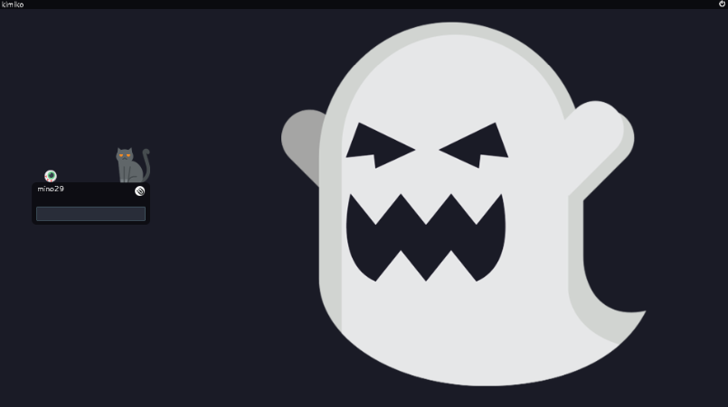
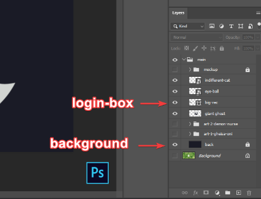

# ghostly-greeter for lightdm
> I made this to go along with my arch-i3 rice
🔎[Dotfiles are here](https://github.com/mino29/arch-i3)

##📺 Overview

**Overview**

> This is how it looks like when working



Essentially it's just a wallpaper, but a special one.
If your screen is 1080p, just follow the installation, you'll be set.
But don't use this screenshot though. I'll show you how next.

If you screen is not 1080p, then you might have to look into the customization
section and scale a little bit yourself.

##🔧 Installation

Assuming you already have a fully functioning linux distro.
You probably using gdm (Gnome) or sddm (KDE as your display manager/login manager.

> Unless you are using ly, then why are you here? XD

Steps:

1. Clone this repo:

```bash
git clone https://github.com/mino29/ghostly-greeter.git
```

2. install lightdm from you package manager. I believe it's available
   everywhere. I'm on arch, so I usually do:

```bash
paru -S --needed --noconfirm lightdm \
                            lightdm-slick-greeter \
                            lightdm-gtk-greeter \
                            lightdm-settings
```

Anyways, lightdm and lightdm-slick-greeter are essential for this to work, but
I suggest you install them all just in case.

3. disable your existing display manager (relax it's just a login screen)

If you on gnome do:

```bash
sudo systemctl disable gdm
```

If you on KDE do:

```bash
sudo systemctl disable sddm
```

4. enable lightdm

```bash
sudo systemctl enable lightdm
```

5. tweak lightdm.conf

```bash
sudo vim /etc/lightdm/lightdm.conf
```

Find `#greeter-session=` under [Seat:*]
It's usually commented out, just uncomment and change it to:

```
greeter-session=lightdm-slick-greeter
```

save it, and DON'T CHANGE ANYTHING ELSE!

> Unless you know what you are doing, in that case, go nuts.

5. OK, now we cd into the cloned repo and copy paste the files that I prepared.

```bash
cd ghostly-greeter
sudo cp -r lightdm /etc
```

6. reboot and voila

```bash
sudo systemctl reboot
```

## 🎨Customization

This works perfectly on my 1080p machine.
I only own 1080p screens, so I don't know about your particular screen setup.
I want you guys to enjoy this theme as much as I do, so I'm sharing the Original
PSD file that I used to make this.

Here the layer structure:



The only things that you might need to tweak are: loginbox and
canvas/background size.

And also maybe the eyeball and cat position.

If you don't like all my config, then I'd suggest using lightdm-setting (GUI)
to make easy adjustment.

However if you insist on using cli to tweak, just be
aware slick-greeter.conf has `[Greeter]`, don't change it to `[greeter]`,
otherwise it won't work and I don't know how to solve it.

```bash
sudo lightdm-settings
```

And change whatever is available.

You can preview the change using:

```bash
dm-tool switch-to-greeter
```

In order to take effect, you do need to reboot your system though.

Hope you enjoyed this thing that I made.

## 💌Credits

- [Giant ghost](https://www.flaticon.com/free-icon/ghost_1234844)
- [Black cat](https://www.flaticon.com/free-icon/black-cat_3504474)
- [Eye ball](https://www.flaticon.com/free-icon/eye-ball_5839804)
